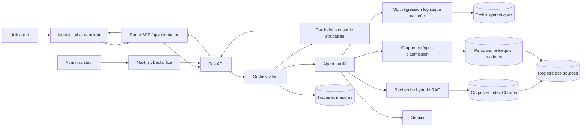

# Architecture d'ORIENT'IA

## Chemin d'une demande

1. Le frontend conserve l'historique côté client et transmet le message et le profil à FastAPI.
2. L'orchestrateur applique les contrôles d'entrée, recherche du contexte et pilote l'agent.
3. L'agent consulte selon le besoin le modèle ML, le corpus RAG, le graphe et les règles d'admission.
4. Les garde-fous valident la structure, la provenance, l'incertitude et l'absence de critères sensibles.
5. L'API renvoie une décision structurée ; le frontend rend les parcours, justifications, sources et avertissements.
6. Le backoffice lit les traces, les mesures, la qualité des données et le graphe du corpus.

## Principes structurants

- Le LLM orchestre et explique ; il n'est pas la source de vérité sur les formations.
- Le ML classe des parcours, tandis que les règles d'admission peuvent signaler une incompatibilité ou une vérification nécessaire.
- Les sources externes ou générées sont explicitement distinguées des sources officielles.
- Une information absente, un profil insuffisant ou une confiance faible provoque une demande d'information ou une escalade, pas une certitude inventée.

